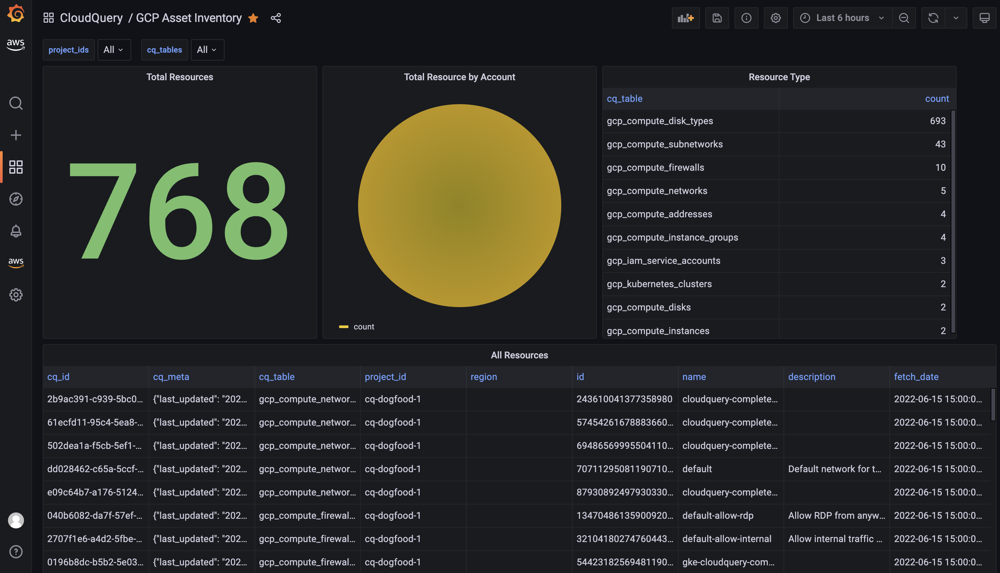

# Dashboards for CloudQuery

[CloudQuery](https://github.com/cloudquery/cloudquery) is an open-source cloud asset inventory powered by SQL.

You can connect PostgreSQL populated by CloudQuery to your favorite BI tools where you create dashboards for visualization, monitoring and alerting.

This repo contains pre-made dashboards for Grafana but you can create similar in any other BI platform.

Checkout those tutorials:
* [Building Open Source Cloud Asset Inventory with CloudQuery and Grafana](https://www.cloudquery.io/blog/open-source-cloud-asset-inventory-with-cloudquery-and-grafana)
* [Building Open Source Cloud Asset Inventory with CloudQuery and Apache Superset](https://www.cloudquery.io/blog/cloud-asset-inventory-cloudquery-apache-superset)
* [Building Open Source Cloud Asset Inventory with CloudQuery and AWS QuickSight](https://www.cloudquery.io/blog/cloud-asset-inventory-cloudquery-aws-quicksight)
* [Building Open Source Cloud Asset Inventory with MetaBase](https://www.cloudquery.io/blog/cloud-asset-inventory-cloudquery-metabase)

## What's inside?

Currently we have cloud asset inventory dashboards for AWS, GCP filterable by account_ids, regions and tables (project_ids for GCP) (more is coming).

### AWS

Located under [./dashboards/aws](./dashboards/aws)

**Note**: aws_asset_inventory.json will require to execute the following [view](https://github.com/cloudquery/cq-provider-aws/blob/main/views/resources.sql) before importing the dashboard.

### GCP

Located under [./dashboards/gcp](./dashboards/gcp)

**Note**: gcp_asset_inventory.json will require to execute the following [view](https://github.com/cloudquery/cq-provider-gcp/blob/main/views/resource.sql) before importing the dashboard.

### Examples

Here is an example of AWS asset inventory Grafana dashboard:

Here is an example of AWS EC2 Public and Private Instances Grafana dashboard:

## Contributions

PRs are welcome with news dashboards, also feel free to ask for new dashboards via [GitHub Issues](https://github.com/cloudquery/grafana-dashboards) or hop on [discord](https://cloudquery.io/discord)

